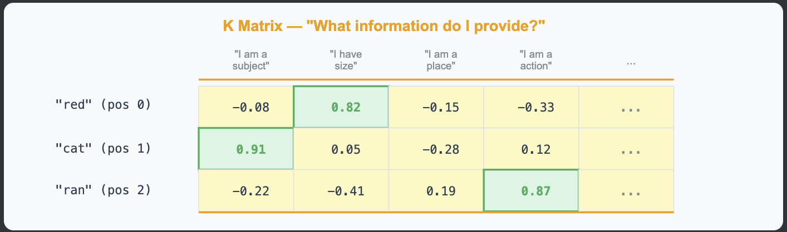
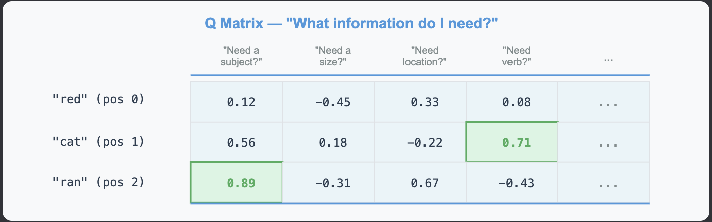
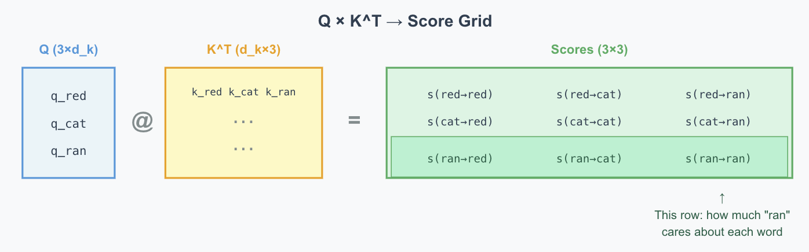
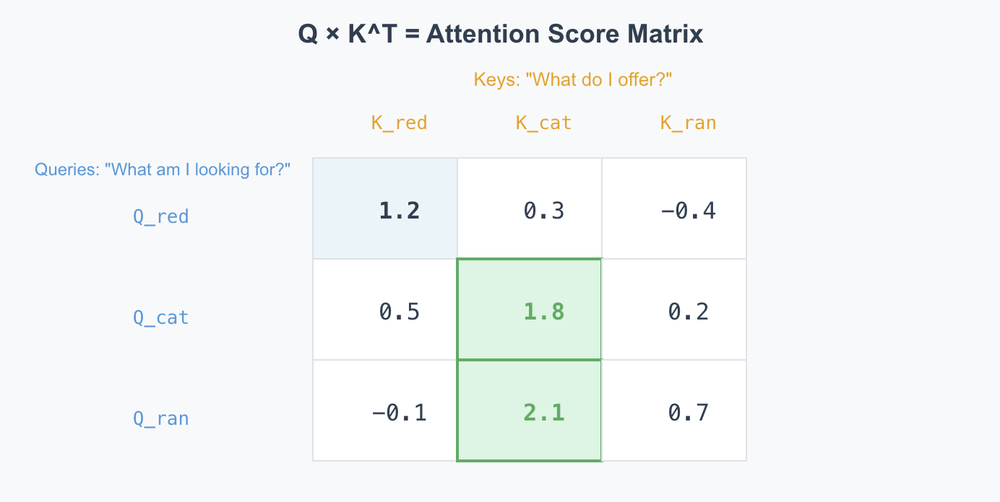
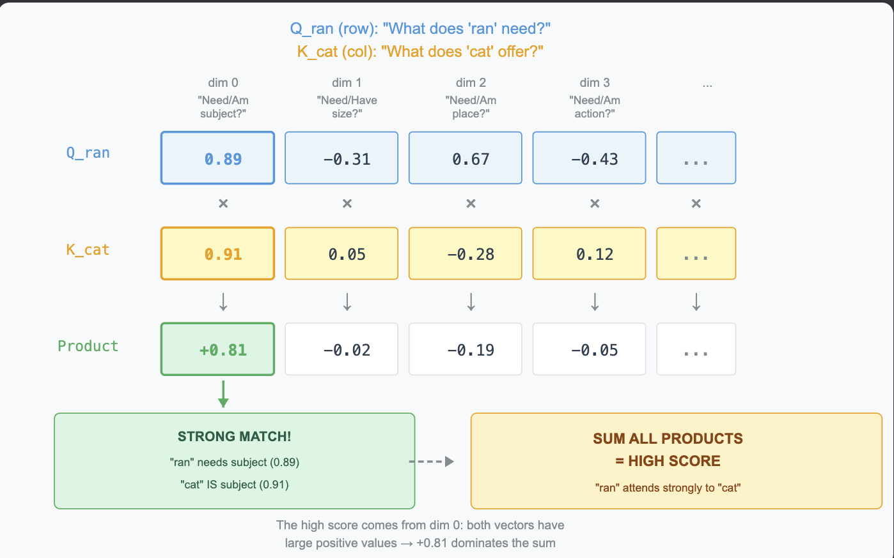
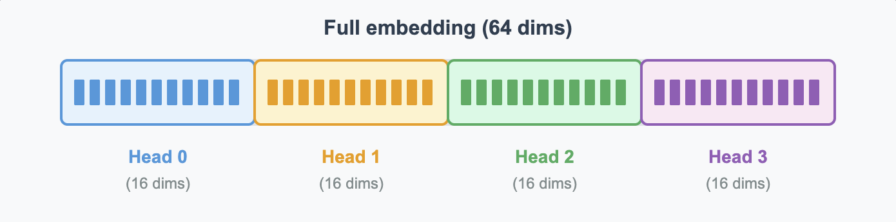
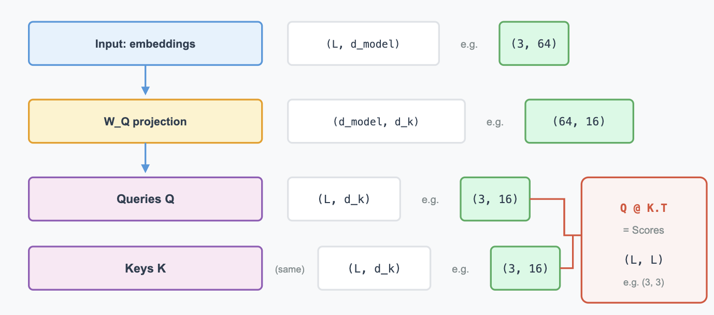
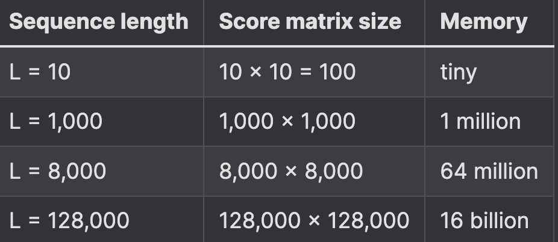

# Module 3: Attention Mechanism
## Building Toward Tiny GPT: Adding Context

- In Module 2, we built a next-word predictor using matrix multiplication and softmax.
- It works, but it has a critical flaw: It treats every word independently.
- Without attention, "bank" gets the same representation in both cases
    - "I deposited money at the bank" - financial institution
    - "The cat sat on the river bank" - edge of a river
- Attention fixes this by comparing words to each other, it computes relationships between all words in the sequence.

## The path ahead:
- Weighted Context - Why weighted sums let the model focus on relevant words.
- Query and Key - How one embedding transforms into two vectors: a qeury and a key
- Q and K Matrices - See how Q × K^T computes all pairwise attention scores at once.
- Attention Dimensions - Understand d_model, d_k, and sequence length (L).
- Scores to Weights - Convert raw scores to proper attention weights using scaling.
- Values: What We Mix - Attention weights tell us "how much" to look at each word.
- Multi-Head Attention - Run multiple attention patterns in parallel.
- Positional Encoding - Attention doesn't know word order by default.
- Building a Context-Aware Predictor - Put everything together into a working predictor that uses attention to understand context.

# We Need Context: From Last Word to Weighted Sum
## Intro
- In Module 2, we built a simple next-word predictor. It takes the embedding of the last word, multiplies by a weight matrix, and produces probabilities:
- embedding = get_embedding(last_word)
- logits = embedding @ lm_head
- probs = softmax(logits)

## First Attempt: Average all embeddings
- context = (embedding("the") + embedding("big") + embedding("cat") + embedding("sat")) / 4
- logits = context @ lm_head
- probs = softmax(logits)
- "the big cat sat" and "the small dog ran" now produce different context vectors because they contain different words.

## Why Averaging isn't enough
- All words treated equally. In "the big cat sat", the word "the" gets the same weight as "cat". 
- "cat" is more important for predicting what comes next.
- Word order is ignored. Consider:
    - "dog bites man"
    - "man bites dog"

## Weighted Sum: Some Words Matter More
- Instead of equal averaging, let each word have its own importance weight:
    - ```
        context = w_the * embedding("the")
        + w_big * embedding("big")
        + w_cat * embedding("cat")
        + w_sat * embedding("sat")
        ```
    - ```context = 0.05 * embedding("the")
        + 0.35 * embedding("big")
        + 0.45 * embedding("cat")
        + 0.10 * embedding("sat")
        + 0.03 * embedding("on")
        + 0.02 * embedding("the")
        ```

## Where do weights come from?
- How does the model automatically decide which words deserve high weights?
- We'll see how "queries" and "keys" become important

# Queries and Keys: How one word finds relevant context
## First attempt: Use embedding similarity directly
- Measure how similar each word's embedding is to the current word's embedding
- ```
    core(word_t, word_j) = dot(embedding(word_t), embedding(word_j))
    ```
- Then convert scores to weights using softmax
- ```
    weights = softmax(scores)
    ```
- Higher similarity → higher weight. Sounds reasonable, right?

## limitations
- It just measures general semantic similarity. "Cat" and "ran" might have moderate similarity (animals run), but that doesn't capture "ran needs to find its subject."

## Query and Key for a single word
- Solution: transform each word's embedding into two different vectors with different purposes
- ```
    For a word with embedding e:

    query = e @ W_Q
    key   = e @ W_K
    ```
- Query: "Given I am this word, what am I looking for?"
- Key: "Given I am this word, how should others find me?"

## Different Transforms, Different Roles
- W_Q and W_K are different matrices that extract different information from the same embedding.
-The verb "ran" has one embedding, but:
    - Its query might emphasize "I need a subject"
    - Its key might emphasize "I am an action/verb"

## Computing Attention Scores
- ```
    score(word_i, word_j) = dot(query_i, key_j)
    ```
- This measures: "Does what word_i is looking for match what word_j offers?"

# Q and K Matrices: Computing All Attention Scores at Once
- From the previous article, each word gets a query and a key:
    - query(word) = embedding(word) @ W_Q
    - key(word)   = embedding(word) @ W_K
    - One word → one query vector, one key vector. Now let's handle a whole sentence.

## Visualizing Q and K Matrices:
- 
- 

## Computing Pairwise Scores Q x K ^ T
- We want to compare every query with every key: "How much should word i attend to word j?"
- Matrix multiplication does this in one operation:
- ```Scores = Q @ K.T```
- 
- 
- 

# Attention Dimensions
- When working with attention, two dimensions appear repeatedly
- d_model - The embedding dimension (64 in our model)
- d_k - The query/key dimension (16 in our model)

## d_model: The Embedding Dimension
- Every word starts as a d_model-dimensional vector. In our model, d_model = 64.
- embedding("cat") = [0.12, -0.34, 0.56, ..., 0.78]  ← 64 numbers

## d_k: The Query/Key Dimension
- When we compute queries and keys, we project to a smaller dimension:
    - embedding (64 dims)  →  W_Q  →  query (16 dims)
    - embedding (64 dims)  →  W_K  →  key (16 dims)

## Why Smaller? Multiple Attention Heads
- Instead of one big attention computation, transformers run several smaller ones in parallel. Each "head" focuses on different aspects of the input - one might track grammar, another might track meaning, another might track position.
- 

## Sequence Length: The Third Dimension
- that's the number of tokens in your input sentence
- "the cat sat"  →  seq_len = 3
- "the big cat sat on the mat"  →  seq_len = 7

## Shape Summary
- 
- The score matrix is L × L - one score for every pair of tokens. For "the cat sat" (L=3), that's a 3×3 matrix with 9 scores.

## The L×L Score Matrix: Context Window
- The score matrix is L × L. That's L² scores to compute and store - and L² grows fast.
- 
- This L×L matrix is why LLMs have a context window limit - the maximum number of tokens they can process at once:
    - GPT-3: 4,096 tokens
    - GPT-4: 8,192 tokens (or 128K in extended version)
- Longer context windows require more memory (L² grows fast) and more computation.

# From Scores to Attention Weights
-  Incomplete