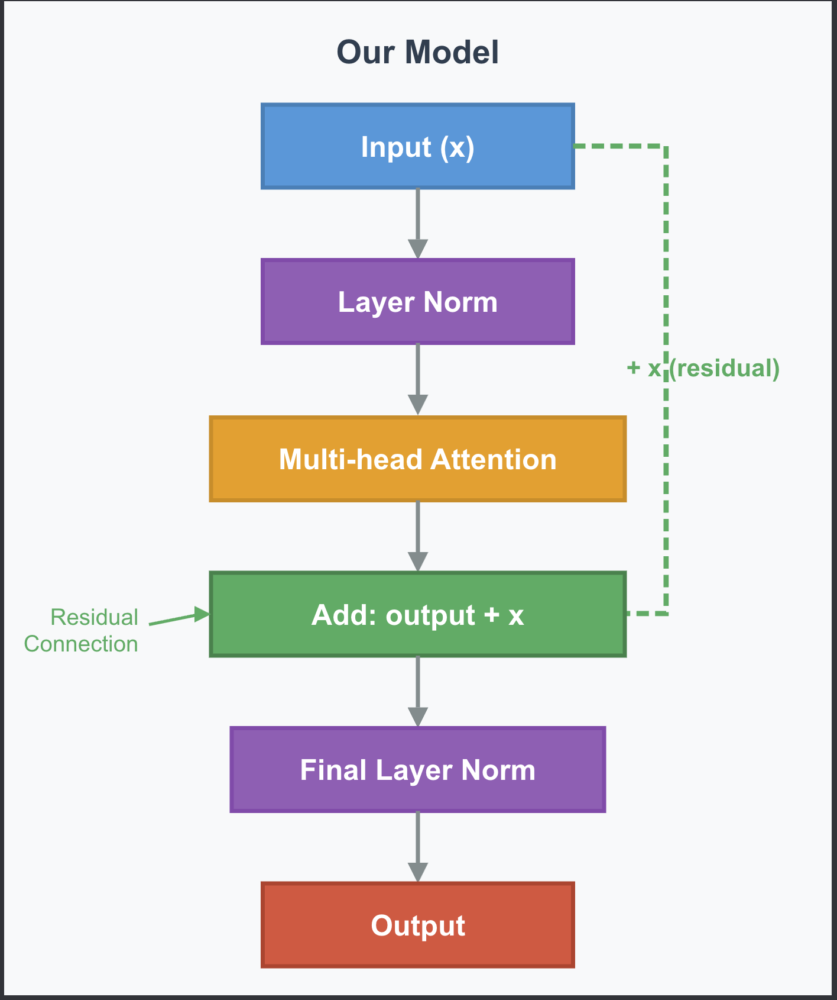

# Module 4: The transformer architecture

## The architecture so far
- If you test model 3, even though we have added attention, predictions are good but not great.
- Two issues limit performance:
    - Unstable values: As numbers flow through attention values can drift. Some numbers grow while others shrink. This incosistency makes the model less reliable.
    - Information loss: Attention transforms the input completely.

## The Missing Components
- We'll add two components that stabilize the network:
    - Layer Normalization: rescales values to a consistent range, before major operations
    - Residual Connections: add original input back after each transformation. ```output = input + transform(input)```
    - "the cat sat" -> embeddings -> attention + **LN** + **residual** -> @ lm_head -> scores

## What about feed-forward networks?
- Real transformers also include a feed-forward networks.
- The FFN enables pattern transformations like "if negation appear, flip sentiment", for large vocabularies and complex text, this matters.
- For our tiny 20-word model, FFN doesn't improve predictions.

## Module 4 Roadmap
- Stabilizing the Network
    - Layer Normalization: keeping values in a consistent range
    - Residual Connections: Preserving information flow
- Assembling our Model:
    - The Transformer Block: Putting attention + LN + Residuals Together
- Scaling to Real Transformers:
    - Why activation alone isn't enough - limits of linear operations
    - Activation Functions
    - Feed-Forward Networks - What GPT adds for complex patterns
- Generation:
    - Sampling strategies - Converting probabilities to tokens
    - Text Generation - Running your complete tiny GPT
- The Complete Picture:
    - Complete Model Review: Tracing through the full architecture
    - Connecting to the Paper: How our model maps to "Attention is all you need"

The architecture you build is the same pattern used by GPT-2, GPT-3, and GPT-4. The only differences are scale (more layers, bigger dimensions) and the FFN component that matters at that scale.

## Layer Normalization
- As values flow through transformations - they can become unstable. Some grow very large while other shrink. This creates problems.
- normalized = x - mean / std + ε
- after this, the values are now roughly between -2 and +2

## Why this matters: consistent scale
- This makes the model easier to train because gradients flow consistently throughout the network

## The Epsilon Constant
- prevents crashing if std deviation is zero

## Where layer norm appears
- Layer Norm appears before attention

## Learnable Parameters: Gamma and Beta
- output = gamma × normalized + beta
- During training, the network learns optimal values for each layer
- Gamma and beta give the network flexibility to adjust distributions

# Residual Connections

## The Deep Network Problem
- As information flows through many transformations, it gets progressively more distorted.
- By the time information reaches layer 10 or layer 20, it bears little resemblance to the original input.
- Think of it like the telephone game. 
- Instead of forcing data through a gauntlet of transformations, residual connections preserve the original values while computing new ones.

## What Residual Connections do
- After transforming the input, add the original input back to the result
- Traditionally: output = transformation(input)
- Residual Connection: output = transformation(input) + input


!Incomplete!


# Assembling Our Model
## Bringing them all together
- Multi-head attention: gathers context from related tokens
- Layer normalization: keeps values stable at consistent scale
- Residual connections: preserve information flow